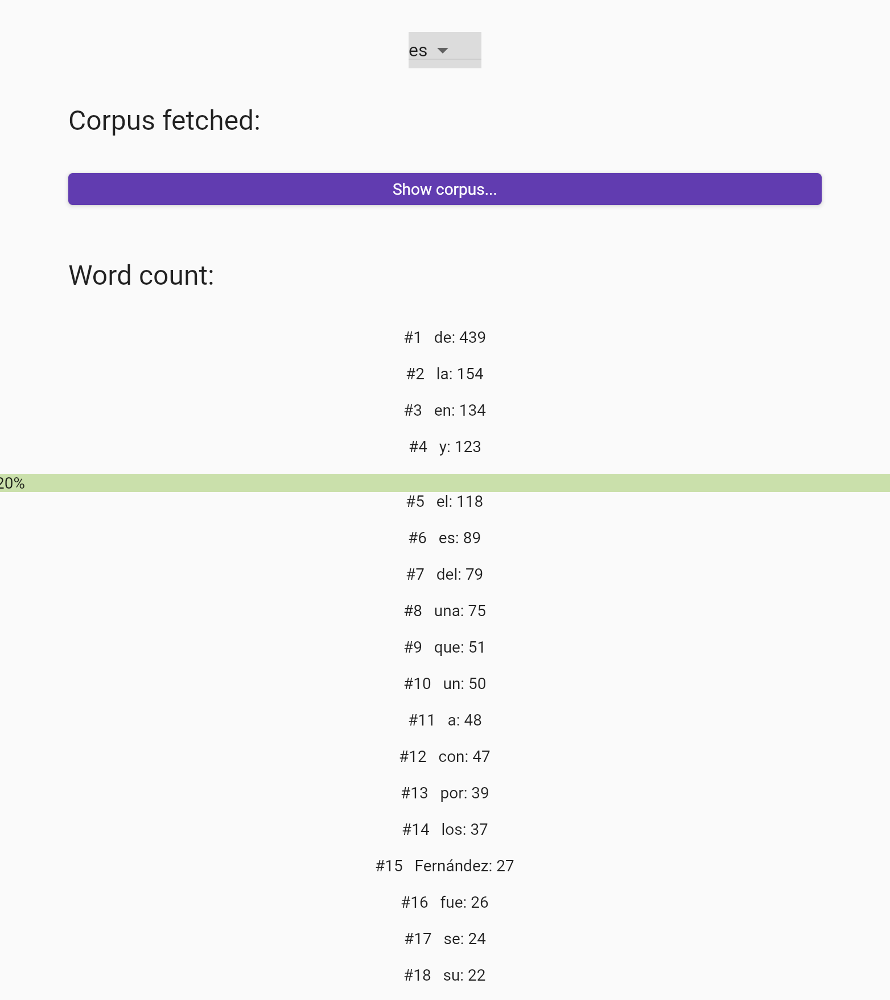
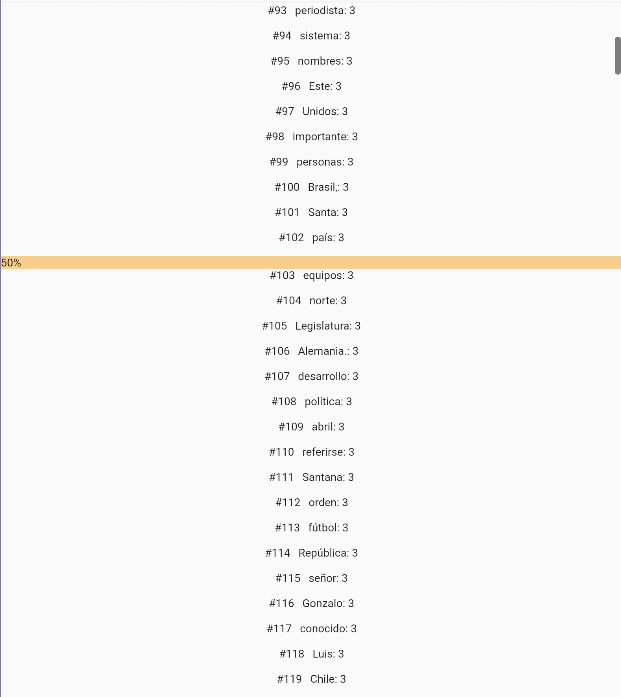

# Zipf

A small Flutter project to demonstrate the Zipf's law with different languages.

Typically, you only need about 5 words to understand 20% of a language,

200 words to understand 50% of a language (A2-B1),

and 1000 words to understand 80% of a language, which would probably amount to being able to speak the language fluently.

The app takes a text corpus of 100 Wikipedia articles in a given language, and then calculates the frequency of each word in the corpus. The words are then sorted by frequency.

There's marks on the graph for the 20%, 50% and 80% thresholds to help visually understand which words would give you a certain percentage.

We can see it's only 100 words to understand 50% of Spanish.
